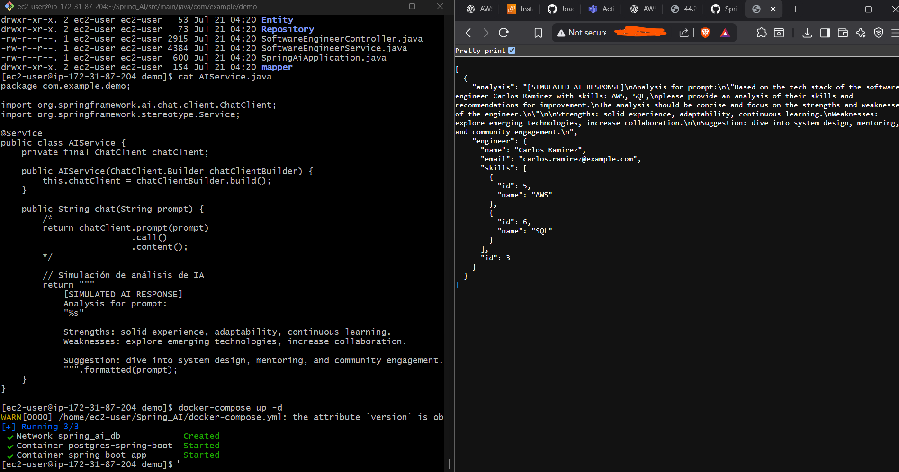
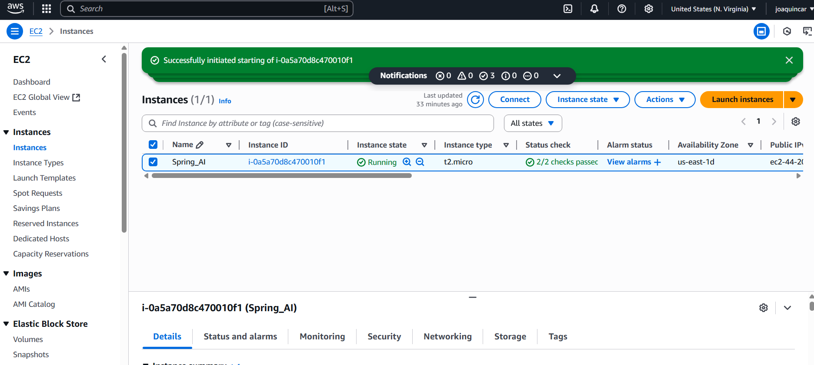
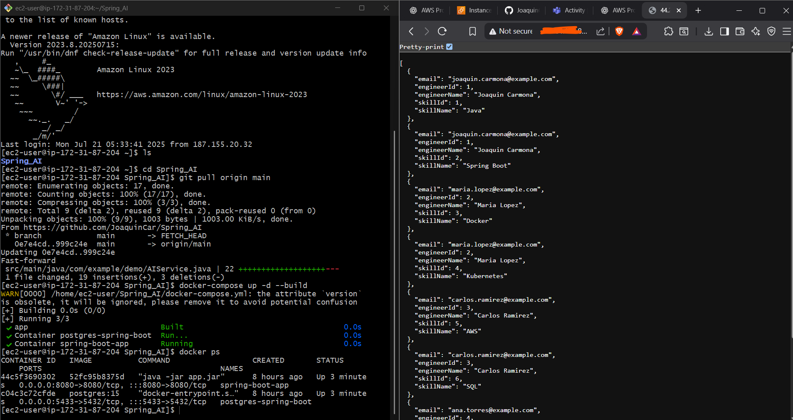

# AI-Powered Software Engineer Skill Analyzer (Spring Boot + AWS)

This project demonstrates the integration of a Java Spring Boot API with an AI analysis service deployed on an AWS EC2 instance. It was developed as a proof of knowledge in cloud infrastructure, backend development, and basic prompt engineering.

---

## 🧠 AI Service Code Snapshot

_Java Service used to interact with the language model_

## 🧠 Purpose

The system allows registering software engineers and their tech stacks, then analyzes their skills using an AI model, generating a concise, human-readable summary of their capabilities.

## 🛠️ Technologies & Tools Used

- **Java 17**
- **Spring Boot 3**
- **PostgreSQL 15**
- **OpenAI Java SDK (Unofficial)**
- **Docker**
- **AWS EC2** (Amazon Linux 2023)
- **Git & GitHub**
  
---

## 📦 Project Structure

The backend provides endpoints to register software engineers and their tech stacks. It includes a special endpoint that sends a prompt to an AI service, which generates a concise analysis of the engineer’s skills.

### Key Features:
- RESTful API for managing engineers and skills.
- Dockerized PostgreSQL database and Spring Boot application.
- AI-based skill analysis using a language model.
- Fully deployed and tested in an EC2 instance with public access.

---

## 🧠 AI Integration

The system uses a Java-based AI client to send prompts to a language model, requesting analysis based on the engineer's skills.

## 🌐 Deployment Notes

The system is deployed on an EC2 instance using Amazon Linux 2023. Security groups are configured to expose ports for:

- HTTP (port 80)
- SSH (restricted by IP)

The AI service runs as a standalone Spring Boot application listening for requests from the backend.

---

